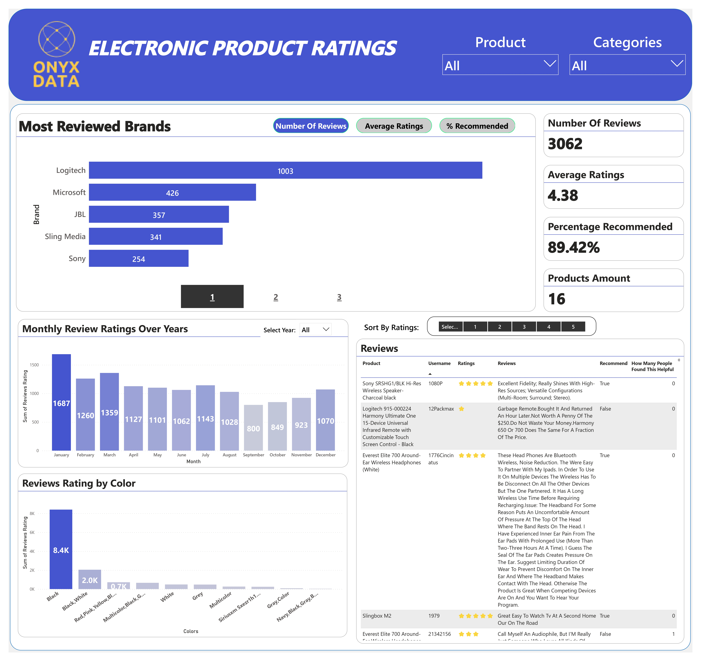

# Electronics Product Ratings Analysis

I took part in the Onyx Data DataDNA Challenge, February 2024. I delved into Electronics Product Ratings, using Power BI for data profiling, cleaning, modeling, and visualization.

## Dataset

The dataset used in this project is the Electronics Product Ratings dataset.

## Tools

The main tool used for this project is Power BI.

## Dashboard

You can explore my interactive dashboard [here](https://app.powerbi.com/view?r=eyJrIjoiOTk5MjcxMzItYjg4Zi00MTgzLWI2OTctOWE4NTkxYjliOThmIiwidCI6IjUxN2QzNTAyLTI5MDEtNGRlMi1hODdiLTk1YzUwN2E5YTA4OCJ9).

## Project Description

This project involves diving deep into the world of Electronics Product Ratings. I’ve used Power BI to visualize the data and uncover insights that could potentially influence future product developments.

To participate in this challenge or view the dataset, [visit](https://www.linkedin.com/posts/onyxdata_onyx-data-datadna-challenge-february-2024-activity-7158730743907536896-Jj-W?utm_source=share&utm_medium=member_desktop)

